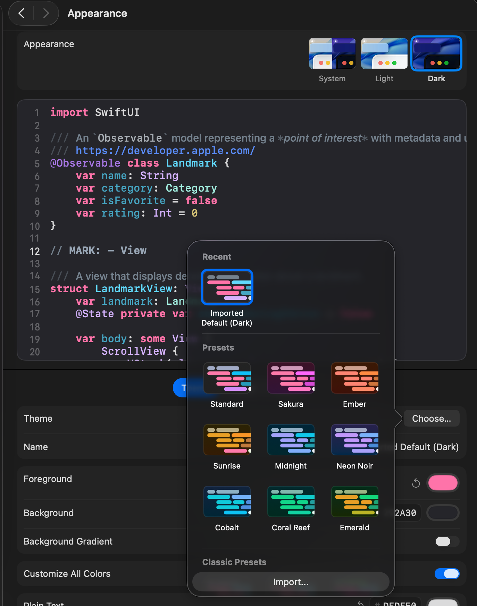

# Xcode 27 Classic Themes

Bring back the classic Xcode themes you know and love in Xcode 27.

## Preview

## Installation

1. Download the theme file (`.xccolortheme`) you want to use from this repository.
2. Open **Xcode 27**.
3. Go to **Settings → Appearance**.
4. In the **Theme** section, click **"Choose..."**.
5. Click **"Import..."** from **Classic Presets**.
6. Select the downloaded theme file.

That's it! Your imported theme will now be available in Xcode 27.

## Available Themes

* Default (Classic)
* Dark
* Dusk
* Midnight
* Presentation
* Sunset
* And others from previous Xcode releases

## Contributing

Feel free to open an issue or submit a pull request if you'd like to improve existing themes or add new ones.

## License

This repository is provided as-is for the Apple developer community.
